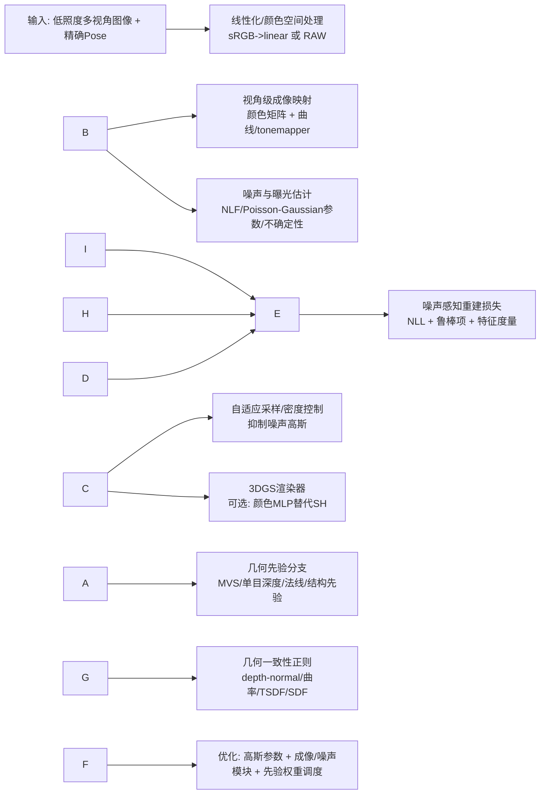
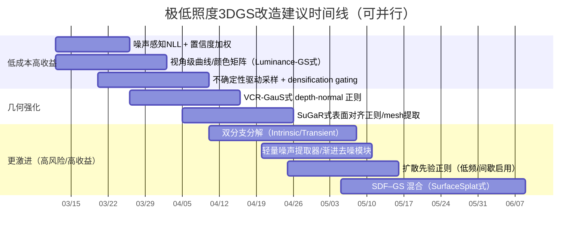

# 极低照度下基于 3DGS 的三维重建：来自视觉与图形学的可落地改进与实验路线图

## 执行摘要

在**极低照度**场景中，3D Gaussian Splatting（3DGS）这类**显式表示**往往比 NeRF 更容易被噪声“带偏”：输入低 SNR 会诱发大量细长/不稳定的高斯原语去拟合噪声纹理，从而同时伤害几何与渲染质量，并拖慢推理速度（“噪声高斯”增殖）citeturn16view0turn28view0。近两年针对“黑暗/曝光异常”输入的 3DGS 研究逐步形成共识：**不要把低照度当作独立的 2D 增强预处理问题**，而应把它纳入**多视角一致的成像模型 + 噪声模型 + 几何先验**的联合优化框架，否则逐视角增强会引入跨视角不一致，反而破坏 3D 重建citeturn3view1turn31search2turn29view2。

基于 2021–2026（重点 2023–2026）文献的系统梳理，本报告给出一套面向你当前“通用 3DGS + 深度/结构先验（借鉴 LITA-GS 思路）”管线的**高收益改造方向**：

* **核心方向 A：噪声感知的监督与不确定性建模**。将 3DGS 的 L1/SSIM 监督升级为符合低照度物理的**异方差（信号相关）噪声似然**（Poisson-Gaussian / heteroscedastic），并用可学习噪声模型或“噪声提取器”估计每像素/每视角的不确定性，从损失权重、采样策略与 densification 上抑制噪声高斯爆炸citeturn15view0turn15view1turn16view0turn29view3。
* **核心方向 B：显式成像过程与曝光/色调一致性**。引入可微的**视角级色彩映射 + 曲线/色调映射（tone curve / tone mapper）**，把“曝光、白平衡、camera response”作为可解释模块嵌入训练以保证跨视角一致；对应代表作包括 Gaussian-DK（相机响应+曝光条件）与 Luminance-GS（视角自适应曲线+颜色矩阵）citeturn17view1turn18view0。
* **核心方向 C：把增强/分解做成 3D 内生变量**。将“反射率–照明–残差/瞬态”分解作为 3D 表示的一部分（而非 2D 预处理），并结合轻量去噪模块或扩散先验做颜色/照明的合理化（LL-Gaussian、LITA-GS、LLNeRF 等）citeturn29view3turn30view0turn31search2。
* **核心方向 D：更强的几何先验（法线/曲率/表面一致性/SDF）**。在你已有深度与结构先验基础上，进一步引入**多视角一致的深度–法线正则（VCR-GauS）、表面对齐/2DGS/SuGaR、或 SDF–GS 混合**提升低纹理/暗区几何稳定性citeturn7search0turn7search3turn7search9turn10search1。

本报告最后提供一个**6–10 项的优先级实验路线图**（含实现工作量、风险与预期收益），以及针对低照度几何的**评测指标/诊断手段**与推荐数据集（含真实低照度多视角与可合成的带 GT 几何基准，如 DTU）citeturn19search0turn5view1turn9view0。

## 近五年研究脉络综述

本节按“2D 低照度 → 成像/噪声建模 → 神经渲染/3DGS in the dark → 几何先验/MVS”串起来，给出你可直接借鉴的模块化思想。

### 低照度影像增强与曝光校正

过去几年，低照度增强从 Retinex/CNN 走向 Transformer/Flow/扩散模型，且出现大量“无参考/弱监督”策略：

* **零参考曲线映射**：Zero-DCE/Zero-DCE++ 将增强建模为曲线估计，训练不需要成对 GT，且推理极快，适合作为“快速 baseline 增强”或做训练早期 curriculumciteturn1search2turn1search6。
* **结构化照明建模**：SCI（CVPR 2022）用自校准方式学习照明，强调效率与鲁棒性citeturn20search8turn20search0。
* **Transformer 低照度增强**：LLFormer 提供 UHD-LOL 基准并提出 Transformer 方法；Retinexformer 提出 one-stage Retinex Transformer，兼顾照明估计与腐蚀恢复citeturn1search13turn1search12turn1search0。
* **Flow/扩散增强**：LLFlow 用 normalizing flow 表达“一对多”的增强分布；LightenDiffusion（ECCV 2024）把 Retinex 分解搬到 latent，并用扩散模型做无监督增强citeturn8search6turn31search0。

关键警告：多篇“低照度神经渲染/3DGS”工作指出，把任意 2D 增强方法逐视角套到多视角数据上会造成**跨视角照明不一致**，从而破坏 3D 优化（LLNeRF 与 LITA-GS 的动机都明确强调这一点）citeturn31search2turn3view1。

### 真实噪声与传感器模型

低照度下，噪声建模是否“统计正确”，直接决定你能否把 photometric loss 变成“有意义的概率监督”：

* **Poisson-Gaussian / 异方差噪声**：FBI-Denoiser 将 Poisson-Gaussian 作为更贴近真实“源相关噪声”的模型，并指出其方差异质、参数估计是核心问题之一citeturn15view1。
* **无干净 GT 的噪声模型学习**：Noise2NoiseFlow（CVPR 2022）强调简单 AWGN 或 heteroscedastic Gaussian（噪声水平函数 NLF）不足以覆盖真实相机噪声，提出只用 noisy-noisy 配对即可联合训练噪声模型与去噪器citeturn15view0。

对 3DGS 的启发：把“噪声与成像”作为可学习模块嵌入渲染监督，而不是把像素差当作确定性误差。

### 低照度神经渲染与 3DGS in the dark

这一分支最贴近你的问题。几个代表性“范式”值得直接复用：

* **Raw/HDR 空间训练**：RawNeRF（CVPR 2022）直接在线性 raw/HDR 空间监督，指出在多张 noisy raw 上联合优化，NeRF 对“零均值 raw 噪声”表现出惊人的鲁棒性，并能从近黑暗场景重建citeturn4view1turn0search11。HDR-NeRF（CVPR 2022）将物理成像过程建模为 radiance field + tone mapper，从多曝光 LDR 复原 HDR radiance fieldciteturn2search7turn2search3。
* **NeRF 系的无监督“分解+增强”**：LLNeRF（ICCV 2023）强调逐视角 2D 增强会破坏一致性，提出在 NeRF 优化过程中联合做照明增强、去噪与颜色校正citeturn31search2turn31search6。Aleth-NeRF（AAAI 2024）提出“concealing field”以解释低照度/过曝成像，并提供 LOM 多视角数据集citeturn6search1turn9view0。
* **3DGS 的三条路线**

  * **相机响应/曝光一致性**：Gaussian-DK（Pacific Graphics 2024）明确把跨视角亮度不一致归因于相机成像，建模 exposure time/ISO/aperture，并用 CNN tone-mapper 映射辐射到像素，同时引入按距离缩放梯度以抑制近处漂浮物（floaters），并提出暗光 benchmarkciteturn17view1turn13search0。
  * **视角自适应曲线**：Luminance-GS（CVPR 2025）不改变 3DGS 显式表示，在训练中引入“视角级颜色矩阵映射 + 视角自适应曲线调整”，把不同曝光/低照度输入映射到一致的“伪正常光”空间，并强调仅训练时做曲线映射以节省测试时间citeturn18view0turn12search2。
  * **“3D 内生分解 + 去噪/扩散先验”**：LITA-GS（CVPR 2025）把 illumination-invariant 结构先验、照明特征与噪声表示作为高斯附加属性，并通过“噪声渲染 + 渐进去噪模块”做无参考训练citeturn30view0turn30view1turn5view1。LL-Gaussian（ACM MM 2025 / arXiv 2025）进一步提出：用学习型 MVS（DUSt3R）先验做“低照度初始化”，并用“双分支高斯分解（Intrinsic/Transient）+ 物理约束 + 扩散先验（StableSR）”联合优化；其消融显示移除初始化/残差/先验都会显著掉点citeturn28view0turn29view3turn29view0turn29view1。
  * **噪声鲁棒重建损失**：From Chaos to Clarity（NeurIPS 2024）专门研究 3DGS 对 noisy raw 的脆弱性，提出噪声提取器与带噪声分布先验的鲁棒重建损失，以减少噪声高斯并提升质量/速度citeturn16view0。LE3D（NeurIPS 2024）面向 RAW HDR 3DGS，指出超低 SNR 会影响结构与 SH 表达能力，并用 Color MLP 取代 SH、加入几何正则等citeturn16view1turn22search1。

你当前已借鉴 LITA-GS 的“深度先验+结构先验监督额外属性”，这与主流趋势高度一致：在极低照度下，**必须在 3D 表示层引入额外可解释变量（照明/噪声/不确定性/几何先验）**，才能把优化问题从“噪声驱动”拉回“几何驱动”。

### 多视图几何与表面先验的最新进展

你要的是“重建”，不仅是 NVS。近两年很多工作把 3DGS 往“几何更准、可提网格”的方向推：

* **表面对齐与可网格化**：SuGaR（CVPR 2024）通过正则项鼓励高斯更贴合表面分布，从而更快提取细致 meshciteturn7search0turn7search8。
* **从体到面：2DGS**：2D Gaussian Splatting（SIGGRAPH 2024）把 3D 高斯“塌缩”为有向 2D 盘片（surfels），强调获得更“视角一致”的表面几何citeturn7search3turn7search11。
* **深度–法线一致性正则**：VCR-GauS（NeurIPS 2024）提出多视角 Depth-Normal 正则并带置信度项，解决以往法线监督只更新旋转、且多视角法线不一致导致伪影的问题citeturn7search9turn11search10turn11search6。
* **SDF–GS 混合**：SurfaceSplat（ICCV 2025）强调 SDF 提供更全局一致几何、3DGS 提供细节渲染，二者互补；此外还有 SplatSDF（2024/2026）等“架构级融合”citeturn10search1turn10search0。
* **学习型 MVS 初始化**：PatchmatchNet（CVPR 2021）等学习型 MVS 在高分辨率深度估计上更高效；DUSt3R（CVPR 2024）强调对任意图像集合做 dense stereo 3D 重建的范式，对低照度初始化尤其有价值citeturn2search0turn31search11。

\---

## 可集成到 3DGS 管线的具体技术清单与实验设计

本节按“你能在通用 3DGS 框架里以最小侵入方式落地”为原则组织。每条都包含：低照度动机、预期收益、集成点、数据/标签、计算代价、建议消融。

为便于讨论，先给出一个“推荐的整体改造骨架”（你可只实现其中子集）：



### 噪声感知的像素似然监督

**动机（低照度）**  
低照度噪声常呈现信号相关与异方差特性，简单 L1/SSIM 会把噪声当作确定性误差，导致错误梯度驱动几何与 densification；Poisson-Gaussian 被广泛用于描述真实源相关噪声citeturn15view1turn15view0。

**预期收益**  
更稳定的优化、更少噪声高斯、更可靠的暗区几何（尤其你不追求实时，允许更复杂损失）。

**集成点（3DGS）**  
把当前 photometric loss：

* `L = (1-λ)\\\\\\\*L1 + λ\\\\\\\*SSIM`（3DGS/LITA-GS/Luminance-GS 常用类似混合）citeturn18view0turn5view0turn30view0  
替换/增强为像素级负对数似然（NLL）：
* 近似方案：异方差高斯 `σ^2(x)=a·I(x)+b`（NLF），NLL `((I-Î)^2 / (2σ^2) + 0.5 log σ^2)`
* 更物理方案：Poisson-Gaussian（若可在线性域近似）。

你可以保留 SSIM 作为结构项，但建议：**SSIM 只作用于“低噪的 intrinsic/reflectance 分支”**（LL-Gaussian 就让 DSSIM 只优化 intrinsic，避免 transient 残差污染静态结构）citeturn29view3。

**需要的数据/标签**  
不需要 GT depth/clean image。仅需估计 `a,b` 或 per-pixel `σ`：

* 可用自监督噪声模型（Noise2NoiseFlow 强调可仅用 noisy-noisy 配对联合学噪声与去噪）citeturn15view0；
* 或在训练内把 `σ` 作为网络输出（见“不确定性与权重”条目）。

**计算代价**  
低到中：每像素多一次 `σ` 估计或少量标量参数；NLL 本身常数级开销。

**建议消融**  
固定几何先验与 densification 超参不变，比较：

1. baseline L1+SSIM
2. 
* 异方差权重（不加 log σ）
3. 
* 完整 NLL（含 log σ）
4. 
* “SSIM 仅作用 intrinsic”  
并监控：噪声高斯数量、covariance 细长程度分布、几何指标（见评测节）。

### 训练期的视角一致曝光/色调映射模块

**动机（低照度）**  
暗光常伴随跨视角曝光/亮度不一致；Gaussian-DK 明确指出这会让 3DGS 出现 ghosting/floaters，并通过“成像过程建模”补偿一致性citeturn17view1turn13search0。Luminance-GS 则用“视角颜色矩阵 + 视角自适应曲线”把输入映射到一致的伪正常光空间并强调跨视角对齐citeturn18view0。

**预期收益**  
跨视角一致性提升 → 更稳的几何、更少漂浮物、对暗区细节更友好。

**集成点（3DGS）**  
两种可选实现（从易到难）：

1. **Luminance-GS 风格（推荐优先）**：  
为每个 view 学一组颜色仿射/矩阵参数 + 曲线参数，把 `rendered` 或 `input` 映射到统一域。Luminance-GS 在 3DGS 内联合学习颜色调整参数，并提出曲线映射用于生成 view-aligned pseudo-enhanced 图像citeturn18view0。
2. **Gaussian-DK 风格**：  
显式建模 exposure time/ISO/aperture（若 metadata 可得则更强；没有也可学习“曝光条件 latent”），然后用 CNN tone-mapper 把辐射映射到像素；还可给每个 Gaussian 加“light feature”处理高光/阴影citeturn17view1。

**需要的数据/标签**  
不需要 paired 正常光 GT。仅需多视角图像 + pose。若有 EXIF（曝光、ISO），可作为条件输入（Gaussian-DK 与多曝光方法倾向使用）citeturn17view1turn28view0。

**计算代价**  
中：每个 view 需要额外参数；tone-mapper 若为 small MLP/CNN，训练每步额外一次前向。一般远小于引入大去噪/扩散。

**建议消融**  
对同一场景：

* 无映射
* 仅 per-view 颜色仿射
* 仿射 + 全局曲线
* 仿射 + view-adaptive 曲线（Luminance-GS）  
比较跨视角重投影误差的方差、几何 floaters 指标、以及渲染指标。

### 内生的“照明–反射率–残差/瞬态”三分解

**动机（低照度）**  
逐视角 2D 增强破坏 3D 一致性这一点已在 LLNeRF、LITA-GS、LL-Gaussian 中反复强调citeturn31search2turn3view1turn29view2。LL-Gaussian 进一步指出：把场景分解为 Intrinsic（反射率+照明）与 Transient（噪声/色偏/光照伪影）可显著提升鲁棒性与可解释性，并给出明确的渲染合成式（元素乘 + 残差相加）citeturn29view3。

**预期收益**

1. 几何更稳定（噪声被“隔离”为 transient，不再推动主几何分支）；
2. 你可以在“增强/正常光输出”目标下保持材质一致性（reflectance consistency）；
3. 有利于不确定性与 densification 的调控（噪声分支专门吸收异常）。

**集成点（3DGS）**  
在每个 Gaussian 上附加属性（你已有类似经验）：

* Intrinsic 分支：`reflectance`（或 SH/MLP 颜色）、`illumination`（可为标量或 3 通道，LL-Gaussian 用 illumination map 并可用 tiny tone-mapping MLP 增强）citeturn29view3
* Transient 分支：`residual`/`noise` 属性 + **per-image embedding**（LL-Gaussian 受 NeRF-W 等启发，为 transient 引入 per-image learnable embedding，用于吸收视角特定变化；且该 embedding 只在训练需要）citeturn29view3turn14search0

参考实现还包括 LITA-GS：给高斯分配“噪声属性”，渲染得到噪声图，再用渐进去噪模块抑制噪声citeturn30view1turn30view0。

**需要的数据/标签**  
无 GT。可用轻量先验（照明平滑、边缘保持），或结合扩散先验（见下一条）。

**计算代价**  
中到高：参数量增加约 1–2 倍（取决于你是否复制一套高斯或仅加属性）；渲染可能需要多输出通道（reflectance/illumination/residual）。

**建议消融**

* baseline（无分解）
* 分解但无 per-image embedding
* 分解 + per-image embedding
* 分解 + “SSIM 只作用 intrinsic”（LL-Gaussian 的关键细节）citeturn29view3

### 渲染内的“噪声提取器/渐进去噪模块”

**动机（低照度）**  
在极低照度下，单纯靠重建损失不足以抑制噪声高斯。From Chaos to Clarity 指出 3DGS 对 noisy raw 特别敏感，会产生大量细长高斯；其方案是引入噪声提取器与基于噪声分布先验的鲁棒重建损失citeturn16view0。LITA-GS 则更工程化：为每个 Gaussian 分配噪声属性，渲染噪声图后用轻量渐进去噪模块（多层 3×3 conv）逐阶段更新噪声估计与去噪图像citeturn30view0turn30view1。

**预期收益**  
显著减少噪声纹理对几何与密度控制的污染；提高收敛速度与最终清晰度。

**集成点（3DGS）**  
两条路线：

* **属性驱动（LITA-GS）**：`noise\\\\\\\_attr` → 渲染噪声图 `N\\\\\\\_GS` → PDM 输出 `N` 与 `R\\\\\\\_clean`citeturn30view1turn30view0
* **网络驱动（Chaos→Clarity 风格）**：渲染结果 → noise extractor → 估计噪声分布参数/噪声成分 → 用 noise-robust loss 更新。

**需要的数据/标签**  
无 GT。若你有 RAW 或高帧数数据，可做更强自监督；RawNeRF 甚至用多张长曝光 burst 合成“干净 GT”来评测去噪，但你在比赛未必具备citeturn5view2。

**计算代价**  
中：多一次轻量网络前向；渐进阶段数越多越贵。

**建议消融**  
固定噪声似然与成像映射不变：

* 不加去噪模块
* 加去噪模块但不渲染噪声图（仅从残差学习）
* 完整方案（噪声属性 + 渲染噪声图 + PDM）  
比较：噪声高斯数量、训练迭代稳定性、暗区细节。

### 从 SH 到颜色 MLP 的辐射/颜色表示升级（面向线性/HDR 与低照度）

**动机（低照度/RAW/HDR）**  
LE3D 指出在 RAW 线性颜色空间下，SH 的表达能力可能不足，提出用 Color MLP 替代 SH，并引入几何正则以提升结构准确性与下游（如 refocus）citeturn16view1turn22search1。Gaussian-DK 也给出了“高斯 light feature + tone-mapper”的思路来处理阴影/高光复杂映射citeturn17view1。

**预期收益**  
在低照度导致的强非线性映射下，颜色 MLP 更容易吸收复杂的曝光/色调函数误差，减少“用几何去解释颜色”的现象。

**集成点（3DGS）**  
保持几何参数不变，把颜色从 `SH coeffs` 改为：

* `feature vector per Gaussian` + `small MLP(view\\\\\\\_dir, feature)` 输出颜色  
或采用混合：低阶 SH + residual MLP（稳定且易控）。

**需要的数据/标签**  
无额外标签。若有 RAW，收益更大（但 sRGB 也可）。

**计算代价**  
中到高：每像素需要 MLP 推理（但可通过小网络、分块、或缓存减少开销；你不需要实时）。

**建议消融**

* SH 基线
* SH + tiny residual MLP
* full Color MLP  
观察：暗区颜色漂移、几何漂浮物数量、以及渲染 NLL。

### 学习型 MVS/深度先验驱动的初始化与几何约束强化

**动机（低照度）**  
即使你有 pose，初始化依然重要。LL-Gaussian 明确在极低照度数据上“直接 COLMAP 初始化失败”，并用 DUSt3R 生成 dense 点云再通过 LLGIM 裁剪/深度引导精炼，从而获得更紧凑高质量初始化，且消融显示去掉 LLGIM 会显著掉点citeturn29view1turn28view0turn29view2。PatchmatchNet 则代表了高效学习型 MVS 深度估计路线citeturn2search0。

**预期收益**  
更可靠的几何骨架、更少噪声 densification、训练更快更稳。

**集成点（3DGS）**

* **初始化**：用 DUSt3R / PatchmatchNet / 你已有的深度先验生成 per-view depth → 融合成点云/TSDF → 初始化 Gaussians。DUSt3R 本身强调 dense stereo 3D 重建范式citeturn31search11。
* **训练中约束**：渲染出深度/法线，与 MVS depth/normal 做一致性损失（你已做 depth/structure，可扩展到 normal/curvature；见后续条目）。

**需要的数据/标签**  
不需要 GT depth；深度先验可来自预训练模型或自监督 MVS。若用 DTU 这类数据做合成实验，则有 GT 几何可评测citeturn19search0。

**计算代价**  
中：前处理跑 MVS/DUSt3R；训练中只需读取深度图并做损失。

**建议消融**

* 随机/稀疏初始化 vs 深度先验初始化
* 深度先验初始化 + 不加深度监督
* 深度先验初始化 + 加深度监督（多尺度权重）  
用几何指标与 densification 行为对比。

### 多视角一致的法线/曲率监督与表面正则

**动机（低照度）**  
暗区纹理弱、噪声强时，深度监督往往还不够，法线/曲率能提供更强的局部几何约束。VCR-GauS 提出“view-consistent depth-normal regularizer + 置信度项”，专门解决多视角法线不一致导致的重建伪影citeturn7search9turn11search10。

**预期收益**  
表面更平滑且更“像表面”（减少泡沫状点云），网格化更可靠。

**集成点（3DGS）**

* 从渲染深度计算法线（或直接渲染法线属性），加入多视角一致损失；
* 引入置信度权重：在暗区/高不确定区域弱化法线监督（VCR-GauS 的思想）citeturn11search10；
* 曲率/二阶正则：对深度或隐式表面做二阶平滑（注意边缘保持，结合结构先验/梯度权重）。

**需要的数据/标签**  
法线可来自：

* 深度先验导出；
* 或 off-the-shelf 单目法线网络（但低照度可能偏；务必加置信度与跨视角一致过滤）。

**计算代价**  
低到中：主要是额外的渲染通道与损失计算。

**建议消融**

* 仅 depth prior
* depth + normal（无置信度）
* depth + normal（带置信度/不确定性加权）  
观察：DTU/T\&T 的 normal consistency、mesh 质量。

### 表面对齐表示：SuGaR / 2DGS 风格的“更几何”的高斯

**动机（低照度）**  
3DGS 的体高斯在噪声驱动下容易“飘”。SuGaR 通过正则鼓励高斯沿表面分布，并能在数分钟内提取高质量 mesh；2DGS 则直接用有向 2D 盘片作为 surface elements，强调几何更准确、视角更一致citeturn7search0turn7search3。

**预期收益**  
几何更“硬”、更可控；对低纹理/暗区尤其有帮助（减少体积漂浮物）。

**集成点（3DGS）**

* 轻量路线：给 3DGS 加入 SuGaR 式表面分布正则与 mesh 提取后 refine 流程citeturn7search0。
* 激进路线：改用 2DGS 表示（更大工程量，但潜在几何收益高）citeturn7search3。

**需要的数据/标签**  
无额外标签，但强烈建议配合 depth/normal 先验，否则收敛慢。

**计算代价**  
中到高（2DGS 通常需要较多代码改动）。

**建议消融**

* baseline 3DGS + 你的深度/结构先验
* 
* SuGaR 正则
* 改 2DGS（若做）  
对比几何完整性与漂浮物。

### SDF–GS 混合：用隐式表面做“全局几何锚”

**动机（低照度）**  
低照度下 photometric 监督弱，显式高斯容易局部最优。NeuS/VolSDF 等隐式 SDF 表示强调更强的几何归纳偏置与可定义表面citeturn10search2turn10search3；SurfaceSplat（ICCV 2025）指出 SDF 擅长粗几何、3DGS 擅长细节渲染，二者互补citeturn10search1turn10search4。

**预期收益**  
在暗区/无纹理处提供全局几何一致性，提升 completeness，减少洞与漂浮物。

**集成点（3DGS）**  
两种模式：

1. **SDF 先、GS 后**：先用 SDF 得粗表面/深度，再初始化 GS 并在训练中保持 SDF 一致性（最常见）。
2. **联合/交替优化**：参考 SurfaceSplat“互相 refine”的思路（工程量更大）citeturn10search1。

**需要的数据/标签**  
不一定需要 GT。可以用多视角一致性 + depth prior 约束 SDF。

**计算代价**  
高：多一个隐式网络与采样/渲染，训练开销显著上升（你无实时要求则可接受）。

**建议消融**

* baseline + 深度/结构先验
* 
* SDF 粗几何约束（固定 SDF 或只训练前期）
* 
* 交替优化（若做）  
重点观察几何 completeness 与暗区洞。

### 基于不确定性的损失自适应、采样与 densification 控制

**动机（低照度）**  
低照度的不确定性极不均匀：暗区/纯噪区域的监督应被弱化，否则会驱动错误几何。近期已有多种“uncertainty-aware GS”方向：如 UNG-GS 引入显式空间不确定场以量化几何不确定性citeturn11search0turn11search12；还有 UncertainGS/相关工作强调用不确定性调权以提升鲁棒性citeturn11search4。更通用的多任务不确定性加权也可借鉴（Kendall \& Gal）citeturn11search7。

**预期收益**  
减少噪声区域过拟合；把算力与 densification 预算集中到“信息量高”的区域；更可靠的置信度输出（便于诊断）。

**集成点（3DGS）**

* **损失权重**：用预测 `σ`（或 SUF）对 photometric/depth/normal 损失做加权。
* **像素采样**：按估计 SNR/梯度/不确定性采样 rays（优先中高 SNR 或结构边缘）。
* **densification**：在高不确定区域先抑制 split/clone，或反过来只在“高不确定但高一致性潜力”的区域 densify（需要一些启发式）。

Gaussian-DK 的“按距离缩放梯度”用于抑制近处 floaters，是一种可落地的 densification 稳定技巧citeturn17view1。

**需要的数据/标签**  
无额外标签；不确定性可从优化残差、NLL、或网络输出获得。

**计算代价**  
低到中：多一个不确定分支/统计量维护。

**建议消融**

* 固定 loss weights
* 只做 loss 加权
* 
* 采样策略
* 
* densification gating  
并记录：高斯数量、训练稳定性、几何完整性。

### 扩散/生成先验作为“颜色/照明合理化”的正则（谨慎但潜力大）

**动机（低照度）**  
极低照度下颜色与照明的观测约束很弱，用生成先验可补足“自然图像颜色分布”的知识。LL-Gaussian 明确使用预训练扩散恢复模型 StableSR 作为冻结先验，提供 learned color constancy prior，并给出训练中权重调度（先大后小/先小后大）citeturn29view0turn31search1。

**预期收益**  
颜色更自然、照明增强更稳定；尤其适用于“伪正常光输出”目标。

**集成点（3DGS）**

* 对渲染的 reflectance/illumination 或最终增强结果加一个“扩散先验一致性/特征距离”项（不要直接做昂贵的迭代采样；用冻结扩散编码器/去噪器特征更可控）。
* 也可用 Low-light 扩散增强模型（如 LightenDiffusion）提供低照度特化先验citeturn31search0turn31search4。

**需要的数据/标签**  
无 GT。注意域差：扩散先验可能引入 hallucination，应通过几何一致性与多视角约束抑制。

**计算代价**  
中到高：引入大模型特征前向（可通过低分辨率/patch/间歇启用降低成本）。

**建议消融**

* 不用扩散先验
* 低分辨率特征先验（每 N 步一次）
* 全分辨率/更频繁  
监控：多视角一致性、几何漂移、以及是否出现“跨视角不一致的幻觉细节”。

\---

## 优先级路线图与对比表

### 推荐的优先级实验路线图（6–10 项）

下表按“低实现成本、对低照度几何最直接、与现有 depth/structure 先验兼容”排序。预期增益以你已具备深度/结构先验为基线做相对判断。



#### 路线图条目（每项给出落地要点与验证方式）

**噪声感知 NLL（优先级最高）**

* 预期收益：抑制噪声驱动梯度（尤其暗区），减少噪声高斯citeturn15view1turn16view0。
* 工作量：低。
* 风险：低（可回退到 L1/SSIM）。
* 关键消融：NLL vs L1/SSIM；NLL+logσ；SSIM 只作用 intrinsic（若你已做分支）。citeturn29view3

**视角级曲线/颜色矩阵（Luminance-GS 思路）**

* 预期收益：跨视角一致性显著提升；减少“视角间亮度漂移”导致的伪影citeturn18view0turn17view1。
* 工作量：中（引入 view 参数与曲线正则）。
* 风险：中（曲线自由度过大可能吸收几何误差）。
* Ablation：仿射 vs 仿射+曲线；只训期启用 vs 训测都启用（Luminance-GS 强调仅训练时用）citeturn18view0。

**不确定性驱动采样 + densification gating**

* 预期收益：减少噪声区域 densify；更快更稳。
* 工作量：中。
* 风险：中（采样偏置需小心）。
* 参考：Gaussian-DK 的 gradient scaling 抑制 floaters；UNG-GS 等不确定建模思路citeturn17view1turn11search0。

**VCR-GauS 式 depth-normal 正则**

* 预期收益：几何表面质量与网格一致性提升citeturn7search9turn11search10。
* 工作量：中。
* 风险：中（法线先验在低照度可能偏，需要置信度）。
* Ablation：无置信度 vs 有置信度；多尺度 depth-normal。

**SuGaR 式表面对齐正则/快速 mesh 提取**

* 预期收益：对重建任务（而非纯 NVS）非常有价值，可更快得到可编辑 meshciteturn7search0。
* 工作量：中。
* 风险：中（正则过强会损失细节）。

**Intrinsic/Transient 双分支分解（LL-Gaussian 思路）**

* 预期收益：对极低照度“噪声与色偏吸收”很强；对你已有先验体系也兼容citeturn29view3turn29view1。
* 工作量：高。
* 风险：中到高（分支分配不当会出现退化解）。
* Ablation：去 residual、去 priors、去 per-image embedding（LL-Gaussian 的消融表明这些都关键）citeturn29view1turn29view0。

**轻量噪声模块（LITA-GS / Chaos→Clarity）**

* 预期收益：进一步压制噪声高斯；可能同时加速推理citeturn30view1turn16view0。
* 工作量：中。
* 风险：中（去噪过强损细节）。

**扩散先验正则（间歇/低频启用）**

* 预期收益：颜色/照明更自然稳定（LL-Gaussian 使用 StableSR 作为冻结扩散恢复先验）citeturn29view0turn31search1。
* 工作量：中到高。
* 风险：高（幻觉、跨视角不一致）。

**SDF–GS 混合（SurfaceSplat / SplatSDF）**

* 预期收益：几何全局一致性提升，暗区 completeness 更好citeturn10search1turn10search0。
* 工作量：高。
* 风险：高（系统复杂度上升）。

### 候选方法/先验对比表（精简）

|方法/先验|类别|集成点（3DGS）|工作量|预期增益|风险|
|-|-|-|-|-|-|
|异方差/Poisson-Gaussian NLLciteturn15view1turn15view0|噪声建模|损失函数|低|高|低|
|噪声提取器 + 噪声先验损失citeturn16view0|去噪+重建|渲染后模块/损失|中|中-高|中|
|噪声属性渲染 + 渐进去噪(PDM)citeturn30view1turn30view0|去噪+重建|高斯附加属性 + 轻量CNN|中|中|中|
|视角颜色矩阵 + 视角曲线(Luminance-GS)citeturn18view0|成像一致性|训练期映射模块|中|高|中|
|相机响应/曝光条件 + tone-mapper(Gaussian-DK)citeturn17view1|成像物理|渲染后成像模块|中-高|高|中|
|Intrinsic/Transient 双分支分解(LL-Gaussian)citeturn29view3turn29view1|3D分解|双分支高斯/embedding/损失调度|高|高|中-高|
|扩散先验正则(StableSR/LightenDiffusion)citeturn29view0turn31search0|学习先验|训练正则/特征一致|中-高|中|高|
|学习型MVS初始化(DUSt3R/PatchmatchNet)citeturn31search11turn2search0|初始化|前处理点云/深度融合|中|中-高|中|
|Depth-Normal一致正则(VCR-GauS)citeturn11search10|几何先验|法线/深度多视角损失|中|中|中|
|表面对齐正则+mesh提取(SuGaR)citeturn7search0|表面正则|正则项/后处理网格|中|中|中|
|2DGS表面盘片表示citeturn7search3|表示升级|替换表示与渲染|高|中-高|高|
|SDF–GS混合(SurfaceSplat/SplatSDF)citeturn10search1turn10search0|混合表示|加SDF网络/交替优化|高|高|高|

你可以把它当作一个“收益–风险”的备选菜单：先做低风险三件套（NLL + 视角曲线/矩阵 + 不确定性采样/密度控制），再上双分支分解与更强几何先验。

\---

## 评测指标、诊断方法与推荐数据集

### 低照度几何评测：不仅看 PSNR

在极低照度下，单纯 PSNR/SSIM/LPIPS 很容易被“曝光差异”与“增强风格”干扰。建议把评测拆成三层：

**渲染/外观层（NVS 质量）**

* PSNR/SSIM/LPIPS：仍然有用，但建议在“对齐后的伪正常光域”计算。LL-Gaussian 在评测前对输出与 GT 的亮度通道做仿射对齐以缓解照明差异，这个技巧对无参考增强很重要citeturn29view1。
* 噪声一致的 photometric NLL：如果你实现了噪声感知 NLL，用 NLL 本身（或 per-pixel likelihood）做诊断，比 PSNR 更贴合训练目标。

**几何层（深度/点云/mesh）**  
如果有 GT 几何（推荐 DTU），使用：

* 深度误差：AbsRel、RMSE、Median 等；并按亮度/SNR 分桶（看暗区退化）。
* 点云/mesh 的 Accuracy、Completeness、F-score：DTU 从结构光扫描提供参考表面用于评测，这是做“低照度退化实验”的黄金基准citeturn19search0。
* 法线一致性：若你引入法线监督，计算渲染法线与参考法线的角度误差，或多视角法线一致性（VCR-GauS 类型工作特别关注）citeturn11search10。

**不确定性与鲁棒性层（极低照度特有）**

* 置信度校准：把预测 `σ` 或不确定场映射到误差分位数，检查可靠性曲线/覆盖率（coverage）。
* 噪声高斯诊断：统计高斯尺度的长宽比（eccentricity）、数量增长曲线、以及“近相机漂浮物”比例；From Chaos to Clarity 与 Gaussian-DK 都指出噪声会诱发细长高斯与漂浮物，需要专门监控citeturn16view0turn17view1。

### 推荐数据集与基准设置

**真实低照度多视角（直接对标任务）**

* **LOM 数据集（Aleth-NeRF）**：包含 5 个场景（buu/chair/sofa/bike/shrub），每个场景提供多视角 normal-light、low-light、over-exposure 以及多种增强版本；有明确训练/测试划分文件，适合你评测“伪正常光输出”的一致性citeturn9view0turn5view1。LITA-GS 也用该数据集做评测，并说明每场景大约 25–48 张 sRGB 图像citeturn5view1turn3view1。
* **RawNeRF 数据集/设置**：适合做 raw/noisy 条件下的对照实验；RawNeRF 还构造了合成不同快门速度并模拟 shot/read noise 的实验来展示 raw 空间训练优势citeturn5view2turn4view1。
* **LL-Gaussian 的 LLRS 数据集**：论文声称采集了“极低照度真实多视角”数据，并显示与多种 baseline 的对比与消融（若公开，可用于补充极端场景）citeturn29view2turn29view1。

**可做“有 GT 几何”的低照度合成评测（强烈推荐）**

* **DTU Robot Image Data Sets**：提供多视角图像与参考表面几何（结构光扫描），可用于严格的几何 accuracy/completeness 评测citeturn19search0。
* **ETH3D**：提供多视角基准与 ground truth 下载入口，并包含原始 raw 图像下载选项（非常适合研究“raw vs sRGB”策略）citeturn19search9turn19search6。
* **Tanks and Temples**：提供室内外复杂场景视频序列与评测服务，适合看 completeness 与真实复杂几何表现citeturn19search1turn19search5。

**合成低照度的关键建议**  
在 DTU/ETH3D 上合成低照度时，不要只做“整体变暗 + 高斯噪声”。更合理做法是：线性化后注入信号相关噪声（Poisson-Gaussian），再加 gamma/色调映射，必要时加入轻微运动模糊（低照度常伴随）——这与 RawNeRF 在合成实验里模拟 shot/read noise 的思想一致citeturn5view2turn15view1。

\---

## 实现与训练策略细节

### 训练配方与超参调度（可直接抄作起点）

**损失权重调度**  
低照度训练常需要“先几何后外观、先稳后细”。一个实用的调度模板：

1. **Warm-up（前 1k–5k iter）**：

   * 提高 depth/structure/normal 权重（你已有基础）；
   * photometric 用 NLL 但做强 clipping，或对暗区降低权重；
   * densification 更保守（提高 split 阈值、降低 clone 频率）。
2. **Main（中期）**：

   * 逐步增加 photometric（或降低几何先验权重），让纹理收敛；
   * 打开视角曲线/颜色矩阵模块（若担心不稳定，可先只开仿射）。
   * 若用扩散先验：间歇启用（每 N 步一次）且只在低分辨率。
3. **Refine（后期）**：

   * 降低噪声分支容量（或增加 residual 正则），避免把真实细节都吸到 transient；
   * 适当提高几何一致性（法线/曲率）来“收紧”表面。

LL-Gaussian 本身给出了某些权重在迭代中“先高后低/先低后高”的设置示例（用于其总损失的不同项），可作为你调度的参考范式citeturn29view0。

**视角曲线模块的约束**  
曲线自由度必须受控，否则会把几何误差吸收进曲线。Luminance-GS 引入无监督损失以保持曲线形状并保证跨视角对齐，且强调只在训练时使用曲线映射以节省测试时间citeturn18view0。工程上建议：

* 曲线参数化为单调、低维（如分段样条/少量控制点）；
* 加强“跨视角同一 3D 点的亮度一致性”约束（用重投影/可见性筛选）。

**噪声高斯抑制的三件套（强烈建议同时做）**

1. NLL/不确定性加权；
2. densification gating（暗区/高不确定降低 split/clone）；
3. gradient scaling（Gaussian-DK 思路，对近处异常高斯降梯度）citeturn17view1turn16view0。

### 数据增强与 curriculum

**噪声增强**  
即便你最终在真实低照度上训练，也建议在训练早期对输入做“额外噪声增强”，让噪声模型/不确定性更稳。关键是**用信号相关噪声**，而不是 AWGN；Poisson-Gaussian 经验与相关噪声估计讨论可参考 FBI-Denoiser/Noise2NoiseFlowciteturn15view1turn15view0。

**分辨率 curriculum**  
先用低分辨率训练几何骨架，再逐步升高分辨率做细节。这对低照度尤为有效：高分辨率暗噪声会诱导早期 densification 走偏。

**“预增强但不锁死”策略**  
可以用轻量增强（Zero-DCE++、SCI、IAT 等）在 early stage 生成辅助输入或作为 teacher，但不要把增强结果当作最终监督目标（避免引入跨视角不一致）。LL-Gaussian 的补充对比指出“LLIE + GS”组合往往仍会因为 3D 一致性被破坏而产生明显伪影citeturn29view2turn1search2turn20search8turn20search1。

\---

## 参考论文与项目链接

下面给出与你问题最相关、且在 2021–2026 期间被广泛引用/复现的关键条目（优先原论文与官方页面/代码）。为遵循格式要求，链接以代码块给出；正文细节已在各节用引用标注。

```text
3DGS / 低照度3DGS
- 3D Gaussian Splatting (Kerbl et al. 2023): https://repo-sam.inria.fr/fungraph/3d-gaussian-splatting/  | code: https://github.com/graphdeco-inria/gaussian-splatting
- Gaussian in the Dark / Gaussian-DK (Pacific Graphics 2024): https://arxiv.org/abs/2408.09130  | code: https://github.com/yec22/Gaussian-DK
- From Chaos to Clarity: 3DGS in the Dark (NeurIPS 2024): https://arxiv.org/abs/2406.08300
- LE3D: Lighting Every Darkness with 3DGS (NeurIPS 2024): https://arxiv.org/abs/2406.06216  | code: https://github.com/Srameo/LE3D
- LITA-GS (CVPR 2025): https://arxiv.org/pdf/2504.00219  | code: https://github.com/LowLevelAI/LITA-GS
- Luminance-GS (CVPR 2025): https://openaccess.thecvf.com/content/CVPR2025/papers/Cui\\\\\\\_Luminance-GS\\\\\\\_Adapting\\\\\\\_3D\\\\\\\_Gaussian\\\\\\\_Splatting\\\\\\\_to\\\\\\\_Challenging\\\\\\\_Lighting\\\\\\\_Conditions\\\\\\\_with\\\\\\\_CVPR\\\\\\\_2025\\\\\\\_paper.pdf  | code: https://github.com/cuiziteng/Luminance-GS
- LL-Gaussian (ACM MM 2025 / arXiv): https://arxiv.org/html/2504.10331v3  | code: https://github.com/sunhao242/LL-Gaussian

低照度神经渲染/成像
- RawNeRF / NeRF in the Dark (CVPR 2022): https://openaccess.thecvf.com/content/CVPR2022/papers/Mildenhall\\\\\\\_NeRF\\\\\\\_in\\\\\\\_the\\\\\\\_Dark\\\\\\\_High\\\\\\\_Dynamic\\\\\\\_Range\\\\\\\_View\\\\\\\_Synthesis\\\\\\\_From\\\\\\\_CVPR\\\\\\\_2022\\\\\\\_paper.pdf  | project: https://bmild.github.io/rawnerf/
- HDR-NeRF (CVPR 2022): https://openaccess.thecvf.com/content/CVPR2022/papers/Huang\\\\\\\_HDR-NeRF\\\\\\\_High\\\\\\\_Dynamic\\\\\\\_Range\\\\\\\_Neural\\\\\\\_Radiance\\\\\\\_Fields\\\\\\\_CVPR\\\\\\\_2022\\\\\\\_paper.pdf
- LLNeRF / Lighting up NeRF (ICCV 2023): https://openaccess.thecvf.com/content/ICCV2023/papers/Wang\\\\\\\_Lighting\\\\\\\_up\\\\\\\_NeRF\\\\\\\_via\\\\\\\_Unsupervised\\\\\\\_Decomposition\\\\\\\_and\\\\\\\_Enhancement\\\\\\\_ICCV\\\\\\\_2023\\\\\\\_paper.pdf  | code: https://github.com/onpix/LLNeRF
- Aleth-NeRF (AAAI 2024) + LOM dataset: https://ojs.aaai.org/index.php/AAAI/article/view/27908  | code/dataset: https://github.com/cuiziteng/Aleth-NeRF

几何先验/表面重建
- SuGaR (CVPR 2024): https://openaccess.thecvf.com/content/CVPR2024/papers/Guedon\\\\\\\_SuGaR\\\\\\\_Surface-Aligned\\\\\\\_Gaussian\\\\\\\_Splatting\\\\\\\_for\\\\\\\_Efficient\\\\\\\_3D\\\\\\\_Mesh\\\\\\\_Reconstruction\\\\\\\_and\\\\\\\_CVPR\\\\\\\_2024\\\\\\\_paper.pdf  | code: https://github.com/Anttwo/SuGaR
- 2D Gaussian Splatting (SIGGRAPH 2024): https://arxiv.org/abs/2403.17888  | code: https://github.com/hbb1/2d-gaussian-splatting
- VCR-GauS (NeurIPS 2024): https://proceedings.neurips.cc/paper\\\\\\\_files/paper/2024/hash/fc9f83d9925e6885e8f1ae1e17b3c44b-Abstract-Conference.html  | code: https://github.com/HLinChen/VCR-GauS
- SurfaceSplat (ICCV 2025): https://openaccess.thecvf.com/content/ICCV2025/papers/Gao\\\\\\\_SurfaceSplat\\\\\\\_Connecting\\\\\\\_Surface\\\\\\\_Reconstruction\\\\\\\_and\\\\\\\_Gaussian\\\\\\\_Splatting\\\\\\\_ICCV\\\\\\\_2025\\\\\\\_paper.pdf
- NeuS (2021): https://arxiv.org/abs/2106.10689
- VolSDF (NeurIPS 2021): https://proceedings.neurips.cc/paper/2021/file/25e2a30f44898b9f3e978b1786dcd85c-Paper.pdf

MVS/初始化
- PatchmatchNet (CVPR 2021): https://openaccess.thecvf.com/content/CVPR2021/papers/Wang\\\\\\\_PatchmatchNet\\\\\\\_Learned\\\\\\\_Multi-View\\\\\\\_Patchmatch\\\\\\\_Stereo\\\\\\\_CVPR\\\\\\\_2021\\\\\\\_paper.pdf
- DUSt3R (CVPR 2024): https://openaccess.thecvf.com/content/CVPR2024/papers/Wang\\\\\\\_DUSt3R\\\\\\\_Geometric\\\\\\\_3D\\\\\\\_Vision\\\\\\\_Made\\\\\\\_Easy\\\\\\\_CVPR\\\\\\\_2024\\\\\\\_paper.pdf

低照度增强/扩散先验（可选）
- Retinexformer (ICCV 2023): https://openaccess.thecvf.com/content/ICCV2023/html/Cai\\\\\\\_Retinexformer\\\\\\\_One-stage\\\\\\\_Retinex-based\\\\\\\_Transformer\\\\\\\_for\\\\\\\_Low-light\\\\\\\_Image\\\\\\\_Enhancement\\\\\\\_ICCV\\\\\\\_2023\\\\\\\_paper.html
- SCI (CVPR 2022): https://openaccess.thecvf.com/content/CVPR2022/papers/Ma\\\\\\\_Toward\\\\\\\_Fast\\\\\\\_Flexible\\\\\\\_and\\\\\\\_Robust\\\\\\\_Low-Light\\\\\\\_Image\\\\\\\_Enhancement\\\\\\\_CVPR\\\\\\\_2022\\\\\\\_paper.pdf
- LightenDiffusion (ECCV 2024): https://www.ecva.net/papers/eccv\\\\\\\_2024/papers\\\\\\\_ECCV/papers/06440.pdf
- StableSR (IJCV 2024): https://link.springer.com/article/10.1007/s11263-024-02168-7

噪声建模
- Noise2NoiseFlow (CVPR 2022): https://arxiv.org/abs/2206.01103
- FBI-Denoiser (CVPR 2021): https://openaccess.thecvf.com/content/CVPR2021/papers/Byun\\\\\\\_FBI-Denoiser\\\\\\\_Fast\\\\\\\_Blind\\\\\\\_Image\\\\\\\_Denoiser\\\\\\\_for\\\\\\\_Poisson-Gaussian\\\\\\\_Noise\\\\\\\_CVPR\\\\\\\_2021\\\\\\\_paper.pdf

评测数据集（GT几何/多视角）
- DTU: https://roboimagedata.compute.dtu.dk/
- ETH3D: https://www.eth3d.net/datasets
- Tanks and Temples: https://www.tanksandtemples.org/download/
```

\---

### 一个可视化的“收益–工作量”象限图（用于选题）

```mermaid
quadrantChart
  title 实验候选项：收益 vs 工作量（主观估计）
  x-axis 低工作量 --> 高工作量
  y-axis 低收益 --> 高收益
  quadrant-1 高收益/低工作量
  quadrant-2 高收益/高工作量
  quadrant-3 低收益/低工作量
  quadrant-4 低收益/高工作量
  NLL/异方差似然: \\\\\\\[0.15, 0.85]
  视角曲线+颜色矩阵: \\\\\\\[0.35, 0.80]
  不确定性采样+密度控制: \\\\\\\[0.40, 0.70]
  depth-normal一致正则: \\\\\\\[0.45, 0.65]
  双分支Intrinsic/Transient: \\\\\\\[0.75, 0.85]
  扩散先验正则: \\\\\\\[0.70, 0.55]
  SuGaR表面对齐: \\\\\\\[0.55, 0.60]
  2DGS表示替换: \\\\\\\[0.90, 0.70]
  SDF–GS混合: \\\\\\\[0.95, 0.80]
```

> 注：象限图用于“排期与取舍”，不是对论文结论的复述。建议从左上角三项先做起，然后再投入高工作量项目。

\---

如果你愿意把你当前管线的关键信息补充两点（不需要发代码）：

1. 输入是 **RAW 还是 sRGB/LDR**？是否有 EXIF（曝光/ISO）？
2. 你目前的“深度/结构先验”来自哪里（单目/学习型MVS/传统MVS）？  
我可以把上述路线图中每项的\*\*实现接口（具体到你应改哪些张量、在哪个 forward 插入、loss 应该怎么写）\*\*进一步收敛到更贴近你现有实现的版本。

